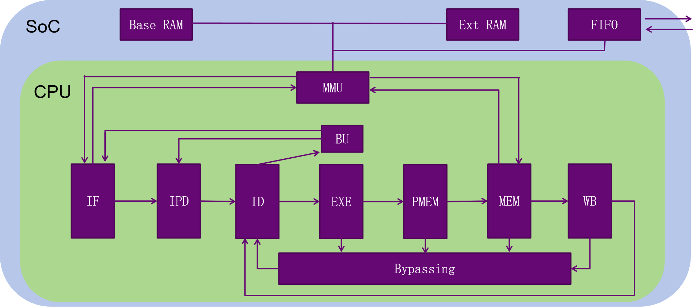

# SimpleCPU

## 概述

本仓库于2024.8进行了重置，将工程从`MIPS`版本调整为`LoongArch`版本，并命名为`YK_Core`。关于原`MIPS`版本内容，请查看`nscscc2023-MIPS`[分支](https://github.com/ykykzq/SimpleCPU/tree/nscscc2023-MIPS)。

本工程使用Verilog语言描述了一个七级流水线CPU，七个流水级分别为`IF`、`IPreD`、`ID`、`EXE`、`PreMEM`、`MEM`、`WB`，各个流水级的功能请参见源代码与相关文档。CPU基于`LoongArch`指令集，支持运算、访存、分支跳转等四十余条用户态指令，具体支持的指令参见[这里](./docs/指令控制信号.xlsx)。该工程还支持串口，通过`UART`协议与外界进行通信。其他技术要求，可以参见[龙芯杯大赛](http://www.nscscc.com)技术方案。

> :heavy_exclamation_mark: 流失级划分仅供参考!
>
> 分这么多流水级只是作者想写一个超过五级的流水线，本作品中流水级划分并不一定合理，并不一定带来很多主频上的收益。

工程使用的综合工具为Vivado 2019.2，尽管如此，如果读者想使用低版本Vivado工具，仍然可以新建一个工程并直接添加Verilog源代码后进行综合。

作品在`MMU`的设计上参考了2022年龙芯杯大赛[作品](https://github.com/xiazhuo/nscc2022_personal)中的`RAM_Serial_ctrl`模块，该作品是一个基于MIPS32的五级流水线CPU，由xiazhuo完成。

## 系统结构

系统的总体架构如下所示。详细设计参见[模块设计说明文档](./docs/各模块设计文档.md)。



:bangbang: 注意：如果使用超过五级的流水线结构，将无法在没有旁路与阻塞模块的情况下通过《CPU设计实战》的exp7

## 项目结构

```
├── docs
│   ├── 指令控制信号.xlsx
│   ├── LoongArch指令码一览.pdf
│   ├── 交叉编译                  # 提供Linux下交叉编译工具链
│   └── 官方文档
├── project                      # NSCSCC提供的vivado工程模板
│   ├── asm
│   ├── thinpad_top.srcs
│   │   ├── constrs_1            # 引脚约束文件
│   │   ├── sim_1                # testbench，本地跑NSCSCC测试用
│   │   └── sources_1
│   │       ├── ip               # 工程所使用的IP核
│   │       ├── myCPU            # 存放CPU源代码🍎
│   │       └── new
│   │           ├── SEG7_LUT.v
│   │           ├── async.v
│   │           ├── thinpad_top.v
│   │           └── vga.v
│   └── thinpad_top.xpr         # Vivado工程文件
├── test                        # 《CPU设计实战》labs
|   ├── README.md
|   ├── func
|   ├── gettrace
|   ├── module_verify           # 测试TLB＆Cache
|   ├── myCPU                   # 本地测试时用。存放CPU源代码🍎
|   └── soc_verify              # 指令集测试
|       ├── soc_axi
|       ├── soc_bram            # Block RAM接口下测试
|       ├── soc_dram            # Distributed RAM接口下测试
|       └── soc_hs_bram
└── README.md

```

## Getting Started

如果你想参与龙芯杯大赛个人赛，这里是一个可行的步骤：

- [ ] 完成前置知识的学习：数字逻辑设计、Verilog语言、计算机组成原理
- [ ] 根据《CPU设计实战》，设计并完成一个五级流水线CPU

> 做单周期与多周期CPU纯在浪费时间

- [ ] 通过《CPU设计实战》中的lab，对五级流水线CPU进行debug
- [ ] 适配NSCSCC大赛的模板，完成：串口添加、地址映射、RAM结构冒险、进一步添加用户态指令
- [ ] 本地仿真，对照三级功能测试与性能测试，进行debug

在上述过程中，你可以参考本项目的源代码。

如果你不想参考《CPU设计实战》一书，也可以参考雷思磊编写的《自己动手写CPU》，按照其书中的步骤一步步完成流水线CPU。

至此，你已经完成了NSCSCC的基本要求，现在你可以添加一些进阶内容。

- [ ] 动态分支预测、流水级拆分、i-cache添加、特权态指令、虚拟内存......

## Tips

注意，完成《CPU设计实战》中的相关实验后，CPU核是无法直接嵌入到NSCSCC提供的模板中的，仍然需要完成一系列工作，这里给出一些提示。

1. 在《CPU设计实战》中，`Inst RAM`与`Data RAM`实际上是分开的，不需要考虑结构冒险。然而在NSCSCC中，`Base RAM`与`Ext RAM`均可被读、写、执行，同时两个`RAM`均只有一个读端口。因此`IF`与`ID`两个流水级在同一拍访问同个RAM时，会发生结构冒险。（参见：[哈佛架构与冯诺依曼架构](https://blog.csdn.net/zhuimeng_ruili/article/details/103485093)）
2. 需要进行的主要任务：**1**.编写一个`MMU`，与之前写好的处理器核（本工程中命名为`YK_Core`）一起，组成`myCPU_top`模块；该`MMU`负责地址映射，并处理串口输入输出，同时检测是否发生`RAM`的结构冒险。**2**.将RAM的处理逻辑改为异步，否则容易出现timing loop问题。
3. 本工程中`test`目录下的代码**并不是最新代码**，而是在前期使用CPU_CDE环境进行开发与测试时的代码。只能保证通过《CPU设计实战》exp11，其中仍然存在若干没有被检测出的bug，这些bug可以参见`project`目录下的后续commit。**最新代码**在`project`目录下。
4. 本工程使用了FIFO Generator IP核，其配置为：Common Clock Builitin FIFO实现，读模式为First Word Fall Through，对于数据读写端口，宽度为8位（串口宽度），深度为512，其他配置保持默认。

## TODO List

- [x] 六级流水线设计，完成20条用户态指令
- [x] 阻塞(或唤醒)模块设计与实现
- [x] 旁路模块设计与实现
- [x] 通过《CPU设计实战》exp7（commit：[v1.0](https://github.com/ykykzq/SimpleCPU/commit/6f57858aa503a204427d251ed48f78b21216acb6)）
- [x] 通过《CPU设计实战》exp8、9（commit：[v2.0](https://github.com/ykykzq/SimpleCPU/commit/6e12934ad4ada67a1a4f0eae59e8954e9a2666b5)、[v2.1](https://github.com/ykykzq/SimpleCPU/commit/d00fffc3704908f9dc4b94863b6e44d64e6c84ea)）
- [x] 添加用户态指令，支持40+条
- [x] 通过《CPU设计实战》exp10（commit：[v3.0](https://github.com/ykykzq/SimpleCPU/commit/69767304f6b3c4f273a12e56c64c6ca434f232fe)）
- [x] 通过《CPU设计实战》exp11（commit：[v4.0](https://github.com/ykykzq/SimpleCPU/commit/79788504854dc162ad1f232458a28d9f5c64e550)）
- [x] 根据NSCSCC大赛要求，添加更多指令
- [x] 根据大赛要求，添加串口通信功能，添加MMU模块
- [x] 拆分MEM流水级，改成七级流水线（commit：[v5.0](https://github.com/ykykzq/SimpleCPU/commit/8827e840047636707783b38004ab3535a086322e)）
- [x] 调试通过三级功能测试与性能测试（commit：[v6.0](https://github.com/ykykzq/SimpleCPU/commit/9279d0921617b95811b0fab053dd8caafe28aa33)）
- [ ] 补充设计文档、总体架构图等内容

## 推荐书籍

《计算机组成与设计：硬件/软件接口》DavidA.Patterson、John L.Hennessy著，康继昌、王党辉等译

《CPU设计实战 LoongArch版》汪文祥、邢金璋著

《超标量处理器设计》姚永斌著
