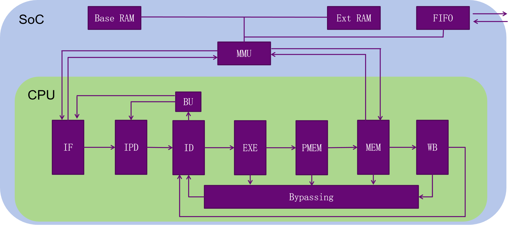

# SimpleCPU

## 概述

本仓库于2024.8进行了重置，将工程从MIPS版本调整为LoongArch版本。

本工程使用Verilog语言描述了一个五级流水线CPU，五个阶段分别为IF、ID、EXE、MEM、WB。CPU基于LoongArch指令集，支持运算、访存、分支跳转等大部分用户态指令，具体支持的指令参见[这里](./docs/CPU控制信号.xlsx)。该工程还支持串口，通过UART协议与外界进行通信。其他技术要求，可以参见[龙芯杯大赛技术方案](http://www.nscscc.com)。

工程使用的综合工具为Vivado 2024.1，尽管如此，仍然可以使用低版本Vivado工具，通过新建一个工程并添加Verilog源代码的方式进行综合。

## 系统结构

系统的总体架构如下所示。



## 项目结构

```
├── docs
│   ├── CPU控制信号.xlsx
│   ├── 交叉编译
│   └── 官方文档
├── project
│   ├── asm
│   ├── thinpad_top.srcs
│   │   ├── constrs_1            # 引脚约束文件
│   │   ├── sim_1                # testbench，本地仿真文件
│   │   └── sources_1
│   │       ├── ip               # IP核
│   │       ├── myCPU            # 存放CPU源代码
│   │       └── new
│   │           ├── SEG7_LUT.v
│   │           ├── async.v
│   │           ├── thinpad_top.v
│   │           └── vga.v
│   └── thinpad_top.xpr         # Vivado工程文件
├── test                        # 《CPU设计实战》labs
|   ├── README.md
|   ├── func
|   ├── gettrace
|   ├── module_verify           # 测试TLB＆Cache
|   ├── myCPU                   # 测试时，用自己CPU替换mycpu_top.v
|   └── soc_verify              # 指令集测试
|       ├── soc_axi
|       ├── soc_bram            # Block RAM接口下测试
|       ├── soc_dram            # Distributed RAM接口下测试
|       └── soc_hs_bram
└── README.md

```

## 推荐书籍

《CPU设计实战》汪文祥、邢金璋

《超标量处理器设计》姚永斌
