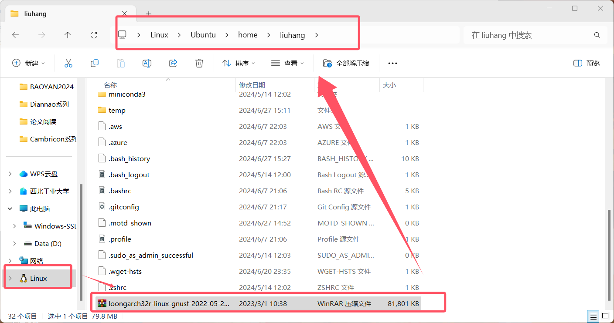
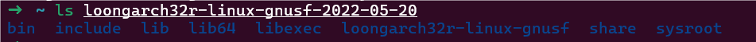
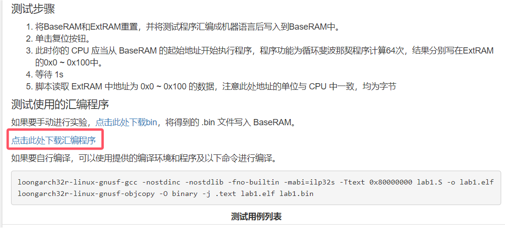

# 本地运行功能测试方法

## 1 配置Linux环境

### 1.1 安装Linux系统

这里可以使用WSL2（Windows Subsystem for Linux）。关于什么是WSL2可以参考CSDN等。如何安装参考[这个链接](https://learn.microsoft.com/en-us/windows/wsl/install)。

### 1.2 配置交叉编译环境

在完成一系列安装步骤、配置好自己的Ubuntu系统之后，我们就可以配置交叉编译环境。

首先获取**交叉编译工具链**，其在龙芯杯官网的[发布包](http://www.nscscc.com/?p=515)里。

然后把 loongarch32r-linux-gnusf-2022-05-20-x86.tar.gz 文件放到Linux的任意目录里，并记住目录的路径。



如上所示，则我放在的位置为 /home/liuhang 下。

下面打开命令行窗口，进入到我们放该压缩包的目录下面。之后使用指令完成解压缩。默认解压路径为当前路径。

```shell
# 切换到压缩包所在目录
cd /home/liuhang
# 完成交叉编译工具链的解压
tar -zxvf loongarch32r-linux-gnusf-2022-05-20-x86.tar.gz
```

解压之后，在当前目录下出现解压文件

```shell
# 打印目录下的所有目录与文件
ls loongarch32r-linux-gnusf-2022-05-20
```



那么bin目录的绝对路径就是  /home/liuhang/loongarch32r-linux-gnusf-2022-05-20/bin ，把这个目录添加到环境变量中即可。

```shell
# 设置环境变量。把路径替换为自己的bin的绝对路径
export PATH=$PATH:/home/liuhang/loongarch32r-linux-gnusf-2022-05-20/bin
```

然后可以尝试运行交叉编译命令，检测环境变量是否设置成功。例如：

```shell
# 尝试运行交叉编译命令
loongarch32r-linux-gnusf-gcc -v
```

如果能打印版本号，表明已经设置成功。否则请检查自己的步骤是否出错。

设置好环境变量之后，我们就可以在任何目录下使用交叉编译工具了。

## 2 获取功能测试的.S文件

请去龙芯杯官网下载。



下载好之后，移动到Linux目录里。

## 3 获取coe文件

首先执行如下命令获取.bin和.data文件

```shell
# 产生elf文件，替换为自己的.S文件名称。
loongarch32r-linux-gnusf-gcc -nostdinc -nostdlib -fno-builtin -mabi=ilp32s -Ttext 0x80000000 lab1.S -o lab1.elf
# 产生bin文件
loongarch32r-linux-gnusf-objcopy -O binary -j .text lab1.elf lab1.bin
# 产生data文件
loongarch32r-linux-gnusf-objcopy -O binary -j .data lab1.elf lab1.data
```

然后再利用《CPU设计实战》中提供的convert程序，获得coe文件。该程序从二进制bin文件中提取coe文件。

这里也把该程序的源代码拷贝到Linux目录下，并进行编译。

```shell
# 编译源程序
gcc convert.c -o convert
```

然后利用生成的convert可执行文件进行提取操作。由于处理的源文件名称在convert中被硬编码为main.bin和main.data，因此需要先重命名。

```shell
# 使用rename命令重命名为main.bin
rename lab1.bin main.bin
rename lab1.data main.data
# 也可以使用mv命令完成重命名
mv lab1.bin main.bin
mv lab1.data main.data
# 提取coe文件
./convert
```

这样，就得到了.coe文件。

## 4 调试方法

关于如何使用反汇编工具，请参考《CPU设计实战》。注意这里使用的是loongarch指令集，所以命令稍有不同，例如反汇编lab1。：

```shell
# 反汇编elf文件到lab_d.S。在调试时可以参照该.S文件观察波形。
loongarch32r-linux-gnusf-objdump -alD lab1.elf > lab1_d.S
```

关于如何将.coe文件写入到RAM里，请参考《CPU设计实战》。